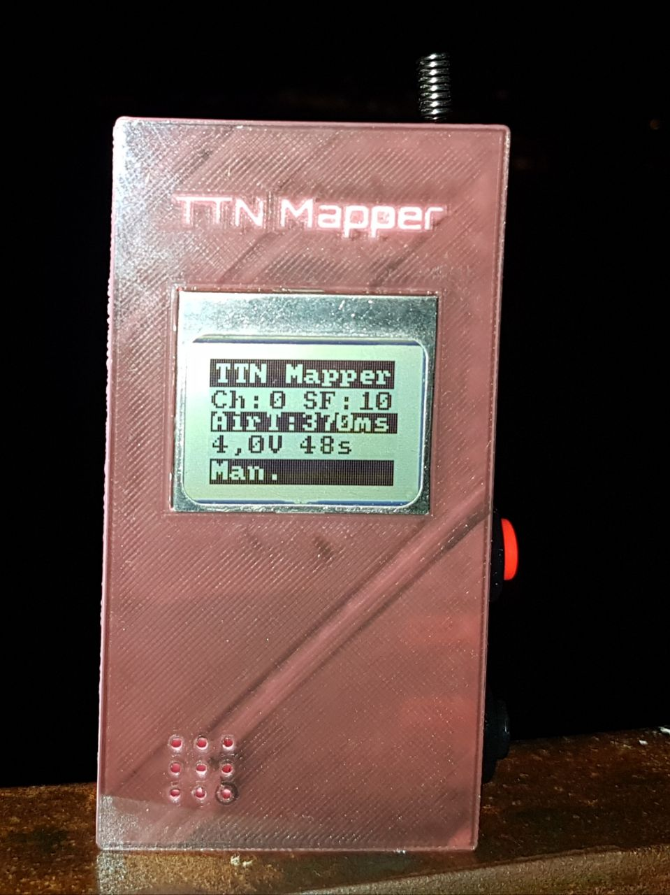

# LoRa_LCD_TTN_Mapper

Arduino LoRaWAN TTN node with LCD for the TTN MApper app, easyly you can select different channels and Spreading Factors

<table width="386" cellpadding="2" cellspacing="0">
	<col width="87">
	<col width="119">
	<col width="166">
	<tr>
		<td width="87" height="12" style="border: 1px groove #000000; padding: 0.05cm">
			
Buttons:

		</td>
		<td width="119" style="border: 1px groove #000000; padding: 0.05cm">
			
<b>Short press</b>

		</td>
		<td width="166" style="border: 1px groove #000000; padding: 0.05cm">
			
<b>Long press</b>

		</td>
	</tr>
	<tr>
		<td width="87" height="13" style="border: 1px groove #000000; padding: 0.05cm">
			
<b>Red</b>

		</td>
		<td width="119" style="border: 1px groove #000000; padding: 0.05cm">
			
Send packet

		</td>
		<td width="166" style="border: 1px groove #000000; padding: 0.05cm">
			
Auto repeat

		</td>
	</tr>
	<tr>
		<td width="87" height="13" style="border: 1px groove #000000; padding: 0.05cm">
			
<b>Black</b>

		</td>
		<td width="119" style="border: 1px groove #000000; padding: 0.05cm">
			
Change Channel

		</td>
		<td width="166" style="border: 1px groove #000000; padding: 0.05cm">
			
Change spreading Factor

		</td>
	</tr>
	<tr>
		<td width="87" height="12" style="border: 1px groove #000000; padding: 0.05cm">
			
<b>Red &amp; Black</b>

		</td>
		<td width="119" style="border: 1px groove #000000; padding: 0.05cm">
			
Turn On/Off Beeper

		</td>
		<td width="166" style="border: 1px groove #000000; padding: 0.05cm">
			
Turn On/Off Backlight

		</td>
	</tr>
</table>

 

Is a hack of the node created from jmateos:
https://github.com/jfmateos/thethingnetwork_madrid_taller_gateway_nodo_single_channel

